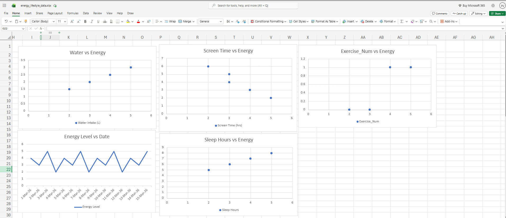

# 📊 Daily Energy Level vs Lifestyle Factors Analysis ⚡

## 📌 Project Overview
This project analyzes how daily lifestyle habits such as sleep, water intake, screen time, and exercise affect energy levels.

The goal is to understand patterns and relationships between these factors using simple data visualization techniques.

---

## 📊 Dataset
- 📅 Time Period: March 1 to March 15, 2026  
- 📌 Type: Sample dataset created for analysis  

### 🔹 Features:
- Date  
- Energy Level (1–5 scale)  
- Sleep Hours  
- Water Intake (Liters)  
- Screen Time (Hours)  
- Exercise (Yes/No)  

---

## 📈 Visualizations

The following graphs were created:

1. **Energy vs Date** – Shows daily energy trend  
2. **Sleep vs Energy** – Relationship between sleep and energy  
3. **Water Intake vs Energy** – Effect of hydration on energy  
4. **Screen Time vs Energy** – Impact of screen usage  
5. **Exercise vs Energy** – Influence of physical activity  

---

## 🧠 Key Insights

- ✅ Higher sleep hours generally lead to higher energy levels  
- 💧 Increased water intake improves energy  
- 📱 More screen time is associated with lower energy  
- 🏃 Exercise positively impacts energy levels  

---

## 🛠️ Tools & Technologies Used

- Python  
- Pandas  
- Matplotlib  
- Microsoft Excel  

---

## 📷 Project Output

---

## 🚀 How to Run the Project

1. Download the repository  
2. Open the Python file (`energy_analysis.py`)  
3. Run the script  
4. View generated graphs  

---

## 📌 Conclusion

This project demonstrates how simple lifestyle changes can impact daily energy levels. It highlights the importance of good habits like proper sleep, hydration, and exercise.

---

## 📂 GitHub Repository

👉 https://github.com/pirallavinitha-source/energy-lifestyle-analysis

---

## 🙌 Acknowledgment

This project is created as part of learning Data Analysis and Visualization.

---
